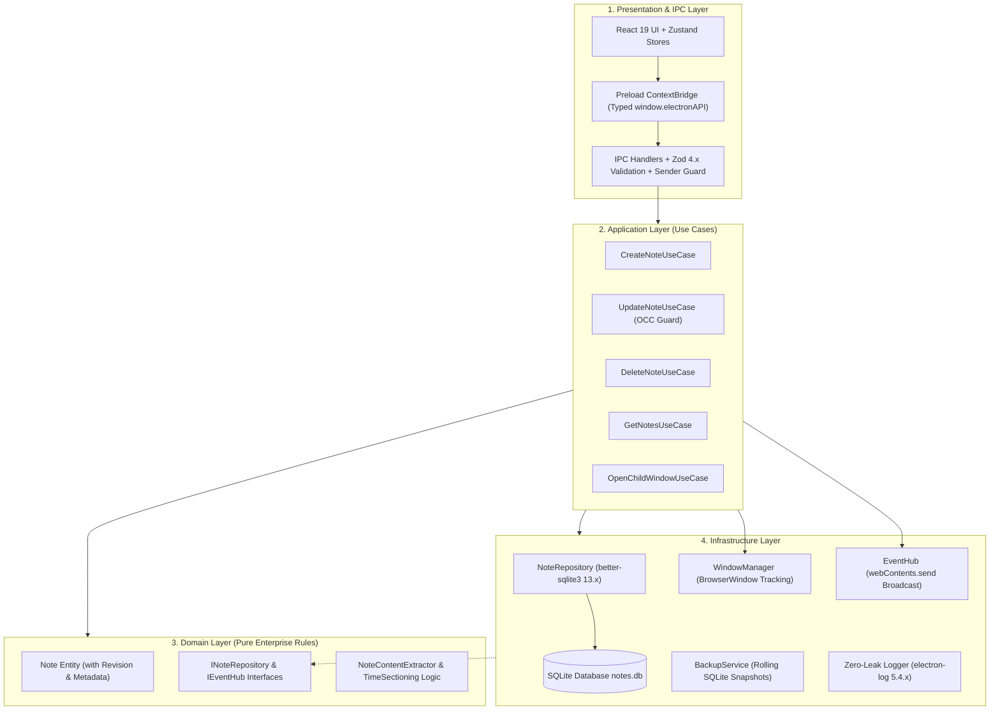
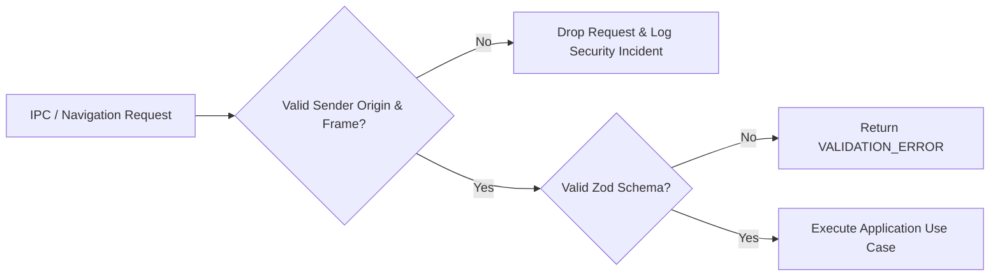
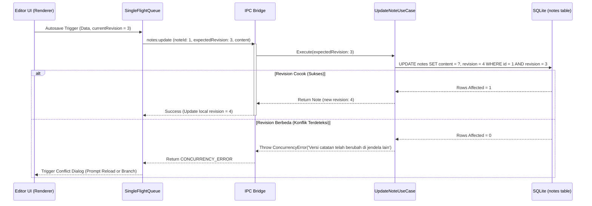

# Dokumen Arsitektur Sistem: Personal Note Desktop App

> **Status:** Production-Ready Baseline Specification (Approved v2.1.0)  
> **Versi:** 2.1.0  
> **Dasar Kebutuhan:** [`PRD-Personal-Note-App.md`](file:///mnt/windows/Users/boyblanco/Documents/code/web/personal_note_electron/PRD-Personal-Note-App.md)  
> **Standar Rekayasa:** Clean Architecture, SOLID Principles, Electron Security Hardening (Zero-Trust Sandbox), React 19 Best Practices, Offline-First SQLite Single Source of Truth, ACID Concurrency Control.

---

## 1. Ringkasan Eksekutif & Karakteristik Sistem

**Personal Note** adalah aplikasi desktop catatan lokal (*offline-first*) berperforma tinggi yang dibangun untuk privasi penuh, keandalan data (*durability*), dan kenyamanan menulis terstruktur menggunakan *block-based editor*. Aplikasi dirancang dengan prinsip *zero-leak* (tanpa ketergantungan cloud atau transmisi data keluar), mendukung pembukaan catatan paralel pada banyak jendela (*multi-window*), kustomisasi tema (*dark/light mode*), dan integrasi kontrol jendela native/frameless yang adaptif terhadap platform (macOS, Windows, Linux).

### Karakteristik Inti Sistem:
1. **Local-First & Zero-Leak**: 100% data tersimpan di perangkat lokal. Tidak ada telemetri invasif atau transmisi data keluar.
2. **Single Source of Truth**: SQLite (`better-sqlite3`) di Main Process adalah satu-satunya sumber data catatan valid. LocalStorage di Renderer hanya digunakan untuk preferensi antarmuka ringan.
3. **Strict Clean Architecture**: Pemisahan tegas 4 lapis (*Domain*, *Application/Use Cases*, *Infrastructure*, dan *Presentation/IPC*) dengan *Dependency Inversion Principle* murni.
4. **Real-Time Cross-Window Synchronization**: Main Process bertindak sebagai *Central Event Hub* yang menyiarkan mutasi data ke seluruh `BrowserWindow` aktif.
5. **Optimistic Concurrency Control (OCC)**: Kontrol konkurensi berbasis kolom `revision` dan antrean *Single-Flight* di sisi client untuk mencegah *race condition* pengetikan dan *silent overwrites* lintas jendela.
6. **Hardened Multi-Layer Security**: Mode sandbox aktif, validasi pengirim IPC (*sender verification*), isolasi konteks penuh, CSP ketat, dan validasi runtime skema via Zod.
7. **Lean & Disciplined Toolchain**: Menghindari bloatware library; setiap dependensi memiliki tanggung jawab arsitektural yang jelas.

---

## 2. Pilihan Teknologi (Technology Stack Baseline)

Seluruh dependensi utama dikunci pada versi stabil terkini dengan kompatibilitas teruji:

| Lapisan / Komponen | Pustaka & Versi Terkunci | Justifikasi Arsitektur |
| :--- | :--- | :--- |
| **Desktop Framework** | **Electron 44.x** (Stable 44.3.x) | Runtime Chromium & Node.js desktop modern dengan patch keamanan sandbox terbaru. |
| **Build & Packaging** | **Electron Forge 7.x** + `@electron-forge/plugin-vite` (Vite 8.x) | Kompilasi ultra cepat, HMR instan untuk React, konfigurasi multi-bundle bersih. |
| **Native Module Tooling**| `@electron/rebuild` + `@electron-forge/plugin-auto-unpack-natives` | Kompilasi C++ binary terhadap Electron ABI dan ekstraksi otomatis `better-sqlite3.node` dari ASAR. |
| **Bahasa Pemrograman** | **TypeScript 5.x** (Stable 5.9.x, Strict Mode) | Menjamin *type-safety* lintas batas IPC, model domain, dan state management. |
| **Database Engine** | **SQLite 3** via **better-sqlite3 13.x** | Driver synchronous C++ binding tercepat untuk Node.js, transaksi ACID andal, hemat memori. |
| **UI Framework** | **React 19.3.x** | Komponen deklaratif modern, React 19 compiler support, rendering lifecycle teroptimasi. |
| **Styling & Theme** | **Tailwind CSS 4.3.x** + CSS Variables | Arsitektur CSS modern berbasis variabel warna HSL, adaptif dark/light tanpa runtime overhead. |
| **Komponen Antarmuka** | **shadcn/ui** (Local Source Ownership) + Radix UI Primitives | Pola distribusi komponen lokal, aksesibilitas WAI-ARIA bawaan via individual Radix primitives. |
| **Block Editor** | **Editor.js 2.31.x** + Official Tool Suite | Editor blok terstruktur (Header, Nested List, Checklist, Code, Quote, Delimiter). |
| **State Management** | **Zustand 5.x** | Store minimalis berkinerja tinggi, pemisahan tajam antara memory store & UI persist. |
| **Virtualisasi List** | **@tanstack/react-virtual 3.x** | Virtualisasi daftar catatan pada sidebar saat jumlah catatan > 300 item (menjaga DOM ringan). |
| **Runtime Validator** | **Zod 4.x** | Validasi skema runtime di gerbang IPC sebelum payload masuk ke lapisan Application. |
| **Testing Framework** | **Vitest 5.x** + **Playwright 1.63.x** | Pengujian 3-tier: Vitest untuk Unit & Integrasi, Playwright untuk otomasi E2E Electron. |
| **Komponen Testing** | **@testing-library/react 16.x** | Pengujian perilaku render komponen React secara terisolasi. |
| **Logging Engine** | **electron-log 5.4.x** (Zero-Leak Structured) | Logging lokal terotasi dengan sanitasi otomatis data privat pengguna. |
| **Static Code Analysis**| **ESLint 9.x** (Flat Config) + **TypeScript ESLint** | Analisis statis untuk menangkap unused variables, unsafe any, dan pelanggaran hooks/arsitektur. |
| **Format Standar** | **Prettier 3.x** | Formatting kode konsisten terpisah dari aturan ESLint (tanpa overhead pre-commit Husky). |

### 2.1. Pustaka yang Ditolak Secara Arsitektural (Explicit Non-Dependencies)
Untuk menjaga aplikasi tetap ramping, berperforma tinggi, dan bebas dari *unnecessary ceremony*:
- ❌ **Redux Toolkit**: Tidak diperlukan; Zustand 5.x jauh lebih ringan dan mencukupi kebutuhan state lokal.
- ❌ **React Query / TanStack Query**: Tidak relevan; aplikasi ini tidak berkomunikasi dengan REST/GraphQL server jarak jauh, melainkan berkomunikasi via IPC ke SQLite lokal.
- ❌ **ORM Berat (Prisma / TypeORM)**: Tidak diperlukan; overhead performa dan kompilasi engine tidak sebanding untuk aplikasi catatan offline; SQL parametrik via `better-sqlite3` jauh lebih cepat dan transparan.
- ❌ **date-fns / Day.js**: Tidak diperlukan untuk v1; kalkulasi kalender lokal (`today`, `yesterday`, `previous`) cukup menggunakan manipulasi native `Date` yang bersih.
- ❌ **Sentry / Cloud Telemetry**: Ditolak keras untuk mematuhi prinsip *Zero-Leak* dan privasi mutlak pengguna.

---

## 3. Prinsip Desain & Standar Rekayasa (Clean Architecture & SOLID)

Arsitektur aplikasi mengadopsi prinsip *Clean Architecture* (Robert C. Martin) yang membagi sistem menjadi lapisan-lapisan konsentris:



### 3.1. Penegakan SOLID Principles
- **Single Responsibility Principle (SRP)**:
  - `NoteRepository`: Hanya menangani SQL dan integritas skema database.
  - `NoteContentExtractor`: Hanya bertanggung jawab mengubah blok Editor.js menjadi representasi teks polos untuk judul dan cuplikan.
  - `TimeSectionService`: Hanya bertanggung jawab mengelompokkan catatan berdasarkan tanggal kalender lokal.
  - `UpdateNoteUseCase`: Mengorkestrasi verifikasi revisi, penyimpanan ke repository, dan pemicuan event mutasi ke EventHub.
  - `IPCHandlers`: Hanya memvalidasi asal request (sender authorization) dan parsing payload via Zod 4.x, lalu meneruskannya ke Use Case terkait.
- **Open/Closed Principle (OCP)**:
  - Registry tool Editor.js dan error handling dapat diekstensi tanpa mengubah kode inti editor atau router IPC.
- **Liskov Substitution Principle (LSP)**:
  - Repository mengimplementasikan interface `INoteRepository`. Dalam pengujian unit/integrasi, repository dapat digantikan oleh implementasi in-memory (`better-sqlite3(':memory:')`) tanpa mengubah satu baris pun kode di lapisan Use Case.
- **Interface Segregation Principle (ISP)**:
  - Preload bridge memecah API menjadi antarmuka yang terfokus: `notes`, `windowControls`, `backup`, `theme`. Client tidak dipaksa bergantung pada fungsi yang tidak diperlukannya.
- **Dependency Inversion Principle (DIP)**:
  - Use Cases di lapisan Application hanya bergantung pada abstraksi interface domain (`INoteRepository`, `IEventHub`), bukan pada driver database konkret `better-sqlite3` atau modul Electron secara langsung.

---

## 4. Keamanan Sistem & Protokol Sandbox (Security Hardening)

Aplikasi desktop memiliki vektor serangan unik jika renderer dapat mengeksekusi kode sembarang atau menavigasi ke URL luar yang berbahaya. Sistem menerapkan pertahanan berlapis (*defense-in-depth*):



### 4.1. Konfigurasi Standar BrowserWindow
Setiap jendela (`BrowserWindow`) wajib mengaktifkan konfigurasi keamanan berikut:

```typescript
const win = new BrowserWindow({
  width: 1200,
  height: 800,
  frame: false, // Frameless untuk custom title bar
  webPreferences: {
    sandbox: true,             // Wajib: Renderer diisolasi dalam sandbox Chromium
    contextIsolation: true,    // Wajib: Memisahkan konteks JavaScript renderer dan preload
    nodeIntegration: false,    // Wajib: Menonaktifkan akses Node.js di renderer
    webSecurity: true,        // Wajib: Mengaktifkan SOP & CORS ketat
    allowRunningInsecureContent: false,
    preload: path.join(__dirname, '../preload/index.js'),
  },
});
```

### 4.2. Kebijakan Navigasi & Tautan Eksternal
1. **Navigasi Internal Terkunci**: Renderer dilarang melakukan navigasi sembarang (`will-navigate`).
2. **Protokol URL Eksternal**: Klik tautan luar (misal dari catatan) wajib dicegat via `setWindowOpenHandler` dan dibuka melalui browser sistem menggunakan `shell.openExternal()`. Protokol berbahaya (`file:`, `javascript:`, `data:`, `shell:`) diblokir secara mutlak:

```typescript
// src/main/app/security.ts
import { BrowserWindow, shell } from 'electron';

export function applySecurityPolicies(win: BrowserWindow): void {
  // Cegah navigasi jendela utama ke URL luar
  win.webContents.on('will-navigate', (event, navigationUrl) => {
    event.preventDefault();
  });

  // Intersepsi window.open / target="_blank"
  win.webContents.setWindowOpenHandler(({ url }) => {
    try {
      const parsed = new URL(url);
      const allowedProtocols = ['https:', 'http:', 'mailto:'];
      if (allowedProtocols.includes(parsed.protocol)) {
        shell.openExternal(url);
      }
    } catch {
      // Abaikan URL tidak valid
    }
    return { action: 'deny' };
  });
}
```

### 4.3. Verifikasi Pengirim IPC (IPC Sender Validation)
Setiap panggilan `ipcMain.handle` wajib memverifikasi bahwa pengirim pesan berasal dari jendela resmi aplikasi yang terdaftar:

```typescript
// src/main/ipc/security/validateSender.ts
import { IpcMainInvokeEvent } from 'electron';
import { WindowManager } from '../../infrastructure/windows/WindowManager';

export function validateIpcSender(event: IpcMainInvokeEvent): void {
  const senderWebContents = event.sender;
  const isRegistered = WindowManager.isValidWebContents(senderWebContents.id);
  
  if (!isRegistered) {
    throw new Error('SECURITY_VIOLATION: Unauthorized IPC sender webContents.');
  }
}
```

### 4.4. Content Security Policy (CSP)
File `index.html` menyertakan meta tag CSP ketat:
```html
<meta http-equiv="Content-Security-Policy" content="default-src 'self'; script-src 'self'; style-src 'self' 'unsafe-inline'; font-src 'self' data:; img-src 'self' data: blob:;">
```

---

## 5. Taksonomi Error & Kontrak Respon IPC

Semua kanal IPC wajib mengembalikan kontrak tipe terdiskriminasi (*discriminated union*) `Result<T, AppErrorPayload>`:

### 5.1. Definisi Kontrak Error (`src/shared/types/result.ts`)

```typescript
export type Result<T, E = AppErrorPayload> =
  | { success: true; data: T }
  | { success: false; error: E };

export type ErrorCode =
  | 'VALIDATION_ERROR'
  | 'NOT_FOUND'
  | 'CONCURRENCY_ERROR'
  | 'DATABASE_ERROR'
  | 'IPC_SECURITY_ERROR'
  | 'BACKUP_ERROR'
  | 'INTERNAL_ERROR';

export interface AppErrorPayload {
  code: ErrorCode;
  message: string;
  details?: unknown;
}
```

### 5.2. Pembungkus IPC Handler Terstandar (`src/main/ipc/utils/createHandler.ts`)

```typescript
import { IpcMainInvokeEvent } from 'electron';
import { ZodSchema, ZodError } from 'zod';
import { Result } from '../../../shared/types/result';
import { validateIpcSender } from '../security/validateSender';
import { AppError } from '../../domain/errors/AppError';

export function createProtectedHandler<TInput, TOutput>(
  schema: ZodSchema<TInput>,
  handler: (input: TInput, event: IpcMainInvokeEvent) => Promise<TOutput>
) {
  return async (event: IpcMainInvokeEvent, rawInput: unknown): Promise<Result<TOutput>> => {
    try {
      // 1. Validasi Keamanan Pengirim
      validateIpcSender(event);

      // 2. Validasi Runtime Skema Payload via Zod 4.x
      const parsedInput = schema.parse(rawInput);

      // 3. Eksekusi Use Case
      const data = await handler(parsedInput, event);
      return { success: true, data };
    } catch (err) {
      if (err instanceof ZodError) {
        return {
          success: false,
          error: {
            code: 'VALIDATION_ERROR',
            message: 'Parameter request tidak valid',
            details: err.flatten(),
          },
        };
      }

      if (err instanceof AppError) {
        return {
          success: false,
          error: {
            code: err.code,
            message: err.message,
            details: err.details,
          },
        };
      }

      console.error('[Unhandled IPC Error]:', err);
      return {
        success: false,
        error: {
          code: 'INTERNAL_ERROR',
          message: 'Terjadi kesalahan sistem internal',
        },
      };
    }
  };
}
```

---

## 6. Model Data, Skema SQLite, & Durabilitas

### 6.1. Konfigurasi Durabilitas Engine (SQLite PRAGMA)
Saat koneksi database dibuka via `better-sqlite3 13.x`, parameter berikut diterapkan secara wajib:

```sql
PRAGMA journal_mode = WAL;          -- Write-Ahead Logging: Konkurensi baca-tulis tinggi, performa write cepat
PRAGMA synchronous = NORMAL;        -- Menjamin integritas WAL tanpa overhead disk fsync penuh di setiap commit
PRAGMA foreign_keys = ON;          -- Integritas relasional
PRAGMA busy_timeout = 5000;         -- Menunggu hingga 5 detik jika terjadi lock sebelum melempar error
```

### 6.2. Kerangka Kerja Migrasi Skema Berbasis `PRAGMA user_version`
Aplikasi menggunakan sistem migrasi transaksional berbasis versi integer native SQLite (`PRAGMA user_version`):

```typescript
// src/main/infrastructure/database/migrations.ts
import Database from 'better-sqlite3';

export interface Migration {
  version: number;
  name: string;
  up: (db: Database.Database) => void;
}

export const MIGRATIONS: Migration[] = [
  {
    version: 1,
    name: '001_create_notes_table',
    up: (db) => {
      db.exec(`
        CREATE TABLE IF NOT EXISTS notes (
          id INTEGER PRIMARY KEY AUTOINCREMENT,
          title TEXT NOT NULL DEFAULT 'Catatan Tanpa Judul',
          snippet TEXT NOT NULL DEFAULT '',
          content TEXT NOT NULL,
          revision INTEGER NOT NULL DEFAULT 1,
          created_at INTEGER NOT NULL,
          updated_at INTEGER NOT NULL
        );

        CREATE INDEX IF NOT EXISTS idx_notes_updated_at ON notes(updated_at DESC);
      `);
    },
  },
];

export class MigrationRunner {
  static run(db: Database.Database): void {
    const currentVersion = db.pragma('user_version', { simple: true }) as number;

    const pendingMigrations = MIGRATIONS.filter((m) => m.version > currentVersion).sort(
      (a, b) => a.version - b.version
    );

    if (pendingMigrations.length === 0) return;

    for (const migration of pendingMigrations) {
      console.log(`Menjalankan migrasi database v${migration.version}: ${migration.name}`);
      
      const executeTransaction = db.transaction(() => {
        migration.up(db);
        db.pragma(`user_version = ${migration.version}`);
      });

      executeTransaction();
    }
  }
}
```

### 6.3. Pemulihan Kerusakan Database (Corruption Recovery Guard)

```typescript
// src/main/infrastructure/database/DatabaseConnection.ts
import Database from 'better-sqlite3';
import path from 'path';
import fs from 'fs';
import { app } from 'electron';
import { MigrationRunner } from './migrations';

export class DatabaseConnection {
  private static instance: Database.Database | null = null;

  static initialize(): Database.Database {
    const userDataPath = app.getPath('userData');
    const dbPath = path.join(userDataPath, 'personal_notes.db');

    let db: Database.Database;

    try {
      db = new Database(dbPath);
      const check = db.pragma('integrity_check', { simple: true });
      if (check !== 'ok') {
        throw new Error(`Database corrupted: ${check}`);
      }
    } catch (err) {
      console.error('CRITICAL: Database SQLite terkorupsi atau gagal dibuka. Melakukan isolasi...', err);
      const corruptPath = path.join(userDataPath, `personal_notes.corrupt.${Date.now()}.db`);
      if (fs.existsSync(dbPath)) {
        fs.renameSync(dbPath, corruptPath);
      }
      db = new Database(dbPath);
    }

    db.pragma('journal_mode = WAL');
    db.pragma('synchronous = NORMAL');
    db.pragma('foreign_keys = ON');
    db.pragma('busy_timeout = 5000');

    MigrationRunner.run(db);

    this.instance = db;
    return db;
  }

  static getInstance(): Database.Database {
    if (!this.instance) {
      throw new Error('Database belum diinisialisasi.');
    }
    return this.instance;
  }

  static close(): void {
    if (this.instance) {
      this.instance.close();
      this.instance = null;
    }
  }
}
```

---

## 7. Penanganan Concurrency & Kontrol Balapan Autosave (OCC)

### 7.1. Alur Optimistic Concurrency Control (OCC)



### 7.2. Implementasi Queue di Sisi Renderer (`src/renderer/utils/SingleFlightQueue.ts`)

```typescript
export class SingleFlightQueue {
  private inFlightPromise: Promise<void> | null = null;
  private pendingPayload: (() => Promise<void>) | null = null;

  enqueue(task: () => Promise<void>): void {
    this.pendingPayload = task;
    this.process();
  }

  private async process(): Promise<void> {
    if (this.inFlightPromise) return;
    if (!this.pendingPayload) return;

    const currentTask = this.pendingPayload;
    this.pendingPayload = null;

    this.inFlightPromise = (async () => {
      try {
        await currentTask();
      } finally {
        this.inFlightPromise = null;
        if (this.pendingPayload) {
          this.process();
        }
      }
    })();
  }
}
```

---

## 8. Logika Domain: Normalisasi Konten & Pengelompokan Waktu

### 8.1. `NoteContentExtractor` Polimorfik (`src/main/domain/services/NoteContentExtractor.ts`)

```typescript
import type { OutputData, OutputBlockData } from '@editorjs/editorjs';

export class NoteContentExtractor {
  static extract(content: OutputData): { title: string; snippet: string } {
    const blocks = content.blocks || [];
    if (blocks.length === 0) {
      return { title: 'Catatan Tanpa Judul', snippet: 'Belum ada konten tulisan...' };
    }

    let rawTitle = '';
    let rawSnippet = '';

    for (const block of blocks) {
      const text = this.extractBlockText(block);
      if (!text) continue;

      if (!rawTitle) {
        rawTitle = text;
      } else if (!rawSnippet) {
        rawSnippet = text;
        break;
      }
    }

    const title = rawTitle.length > 0 ? rawTitle.slice(0, 80) : 'Catatan Tanpa Judul';
    const snippet = rawSnippet.length > 0 ? rawSnippet.slice(0, 140) : '';

    return { title, snippet };
  }

  private static extractBlockText(block: OutputBlockData): string {
    const data = block.data;
    if (!data) return '';

    let text = '';

    switch (block.type) {
      case 'header':
      case 'paragraph':
      case 'quote':
        text = typeof data.text === 'string' ? data.text : '';
        break;

      case 'list':
        if (Array.isArray(data.items)) {
          text = data.items
            .map((item: any) => (typeof item === 'string' ? item : item?.content || ''))
            .filter(Boolean)
            .join(', ');
        }
        break;

      case 'checklist':
        if (Array.isArray(data.items)) {
          text = data.items
            .map((item: any) => item.text || '')
            .filter(Boolean)
            .join(', ');
        }
        break;

      case 'code':
        text = typeof data.code === 'string' ? data.code : '';
        break;

      default:
        text = typeof data.text === 'string' ? data.text : '';
        break;
    }

    return this.cleanText(text);
  }

  private static cleanText(htmlOrText: string): string {
    return htmlOrText
      .replace(/<[^>]*>?/gm, '')
      .replace(/&nbsp;/g, ' ')
      .replace(/&amp;/g, '&')
      .replace(/&lt;/g, '<')
      .replace(/&gt;/g, '>')
      .replace(/&quot;/g, '"')
      .replace(/\s+/g, ' ')
      .trim();
  }
}
```

### 8.2. Logika Pengelompokan Kalender Lokal (`src/shared/utils/timeSectioning.ts`)

```typescript
import { NoteMetadata, GroupedNotes } from '../types/note';

export function groupByTimeSection(notes: NoteMetadata[], referenceDate = new Date()): GroupedNotes {
  const year = referenceDate.getFullYear();
  const month = referenceDate.getMonth();
  const date = referenceDate.getDate();

  const startOfToday = new Date(year, month, date, 0, 0, 0, 0).getTime();
  const startOfYesterday = new Date(year, month, date - 1, 0, 0, 0, 0).getTime();

  const grouped: GroupedNotes = {
    today: [],
    yesterday: [],
    previous: [],
  };

  for (const note of notes) {
    if (note.updatedAt >= startOfToday) {
      grouped.today.push(note);
    } else if (note.updatedAt >= startOfYesterday) {
      grouped.yesterday.push(note);
    } else {
      grouped.previous.push(note);
    }
  }

  grouped.today.sort((a, b) => b.updatedAt - a.updatedAt);
  grouped.yesterday.sort((a, b) => b.updatedAt - a.updatedAt);
  grouped.previous.sort((a, b) => b.updatedAt - a.updatedAt);

  return grouped;
}
```

---

## 9. Siklus Hidup Aplikasi & Single-Instance Lock

```typescript
// src/main/app/AppLifecycle.ts
import { app } from 'electron';
import { WindowManager } from '../infrastructure/windows/WindowManager';
import { DatabaseConnection } from '../infrastructure/database/DatabaseConnection';
import { BackupService } from '../infrastructure/backup/BackupService';

export class AppLifecycle {
  static bootstrap(): void {
    const gotTheLock = app.requestSingleInstanceLock();
    if (!gotTheLock) {
      console.warn('Aplikasi instance lain sedang berjalan. Mengakhiri proses ini.');
      app.quit();
      return;
    }

    app.on('second-instance', () => {
      const mainWin = WindowManager.getMainWindow();
      if (mainWin) {
        if (mainWin.isMinimized()) mainWin.restore();
        mainWin.focus();
      }
    });

    app.whenReady().then(() => {
      DatabaseConnection.initialize();
      BackupService.createRollingSnapshot();
      WindowManager.createMainWindow();

      app.on('activate', () => {
        if (WindowManager.getAllWindows().length === 0) {
          WindowManager.createMainWindow();
        }
      });
    });

    app.on('window-all-closed', () => {
      if (process.platform !== 'darwin') {
        app.quit();
      }
    });

    app.on('before-quit', () => {
      DatabaseConnection.close();
    });
  }
}
```

---

## 10. Strategi Backup & Ekspor Data

### 10.1. Snapshot Rotasi Otomatis (SQLite Online Backup API)

```typescript
// src/main/infrastructure/backup/BackupService.ts
import path from 'path';
import fs from 'fs';
import { app } from 'electron';
import { DatabaseConnection } from '../database/DatabaseConnection';

export class BackupService {
  private static MAX_SNAPSHOTS = 3;

  static async createRollingSnapshot(): Promise<void> {
    const db = DatabaseConnection.getInstance();
    const backupDir = path.join(app.getPath('userData'), 'backups');

    if (!fs.existsSync(backupDir)) {
      fs.mkdirSync(backupDir, { recursive: true });
    }

    for (let i = this.MAX_SNAPSHOTS - 1; i >= 1; i--) {
      const source = path.join(backupDir, `notes.backup-${i}.db`);
      const dest = path.join(backupDir, `notes.backup-${i + 1}.db`);
      if (fs.existsSync(source)) {
        fs.copyFileSync(source, dest);
      }
    }

    const latestBackupPath = path.join(backupDir, 'notes.backup-1.db');
    await db.backup(latestBackupPath);
    console.log('[BackupService] Rolling snapshot berhasil disimpan:', latestBackupPath);
  }
}
```

---

## 11. Arsitektur Logging (Zero-Leak)

```typescript
// src/main/infrastructure/logger/logger.ts
import log from 'electron-log';
import path from 'path';
import { app } from 'electron';

log.transports.file.resolvePathFn = () => path.join(app.getPath('userData'), 'logs/personal-note.log');
log.transports.file.maxSize = 5 * 1024 * 1024; // 5 MB rotasi
log.transports.file.format = '[{y}-{m}-{d} {h}:{i}:{s}.{ms}] [{level}] {text}';

export const logger = {
  info: (message: string, meta?: Record<string, unknown>) => {
    log.info(message, meta ? sanitize(meta) : '');
  },
  warn: (message: string, meta?: Record<string, unknown>) => {
    log.warn(message, meta ? sanitize(meta) : '');
  },
  error: (message: string, error?: unknown) => {
    log.error(message, error);
  },
};

function sanitize(meta: Record<string, unknown>): Record<string, unknown> {
  const clean = { ...meta };
  if ('content' in clean) clean.content = '[REDACTED_CONTENT]';
  if ('blocks' in clean) clean.blocks = '[REDACTED_BLOCKS]';
  return clean;
}
```

---

## 12. Non-Functional Requirements (NFR) & Metrik Performa

| Aspek NFR | Spesifikasi Target | Metode Implementasi & Validasi |
| :--- | :--- | :--- |
| **Cold Startup Time** | **< 800 ms** (hingga UI siap ketik) | SQLite WAL mode, single bundle Vite branching, lazy evaluation service. |
| **Note Switching Latency**| **< 50 ms** | Query metadata cepat via index `updated_at`, pemuatan blok on-demand. |
| **Autosave Commit Time** | **< 30 ms** | Transaksi atomik SQLite `better-sqlite3 13.x` via C++ bindings langsung. |
| **Memory Footprint** | **< 150 MB** baseline idle | Pembersihan unmounted Editor.js instance, isolasi store runtime. |
| **Skalabilitas Catatan** | **Dukungan hingga 10.000+ catatan** | Sidebar menerapkan `@tanstack/react-virtual 3.x` otomatis bila jumlah catatan > 300 item. |
| **Aksesibilitas (a11y)** | **WCAG 2.1 Level AA** | Full keyboard navigation (`Tab`, `Esc`, `Enter`), ARIA roles Radix UI, `motion-reduce:` support. |

---

## 13. Piramida Pengujian (Three-Tier Testing Architecture)

- **Tier 1: Unit Tests (Vitest 5.x)**: Pengujian logika domain murni (`NoteContentExtractor`, `timeSectioning`).
- **Tier 2: Integration Tests (Vitest 5.x + SQLite `:memory:`)**: Pengujian Use Cases, `NoteRepository`, integrasi transaksi OCC, dan `MigrationRunner`.
- **Tier 3: E2E Tests (Playwright 1.63.x Electron)**: Otomasi pengujian lintas jendela, sinkronisasi event mutasi real-time, custom title bar drag region, dan dialog konfirmasi hapus.

---

## 14. Struktur Direktori Proyek (Clean Architecture Layout)

```
personal_note_electron/
├── .agents/                          # Skill configs & rules
├── .github/
│   └── workflows/
│       └── ci.yml                    # GitHub Actions CI Workflow
├── eslint.config.mjs                 # ESLint 9 Flat Config (TypeScript + React Hooks)
├── .prettierrc                       # Prettier configuration
├── forge.config.ts                   # Konfigurasi Electron Forge (Vite Plugin + Makers)
├── vite.main.config.ts               # Vite config untuk Main Process (better-sqlite3 external)
├── vite.preload.config.ts            # Vite config untuk Preload script
├── vite.renderer.config.ts           # Vite config untuk React Renderer + Tailwind CSS
├── vitest.config.ts                  # Konfigurasi Vitest 5.x (Unit & Integration)
├── playwright.config.ts              # Konfigurasi Playwright 1.63.x (E2E Electron)
├── tsconfig.json                     # Root TypeScript configuration (strict)
├── package.json                      # Dependensi & NPM scripts
├── PRD-Personal-Note-App.md          # Dokumen Kebutuhan Produk
├── ARCHITECTURE.md                   # Dokumen Arsitektur Sistem (Spesifikasi Produksi)
│
├── src/
│   ├── main/                         # MAIN PROCESS (Node.js)
│   │   ├── index.ts                  # Entry point bootstrap aplikasi
│   │   ├── app/                      # Application Lifecycle & Security Guard
│   │   │   ├── AppLifecycle.ts       # Single-instance lock, ready, activate, quit
│   │   │   └── security.ts           # will-navigate & external URL policies
│   │   │
│   │   ├── application/              # USE CASES (Business Transactions)
│   │   │   ├── notes/
│   │   │   │   ├── CreateNoteUseCase.ts
│   │   │   │   ├── UpdateNoteUseCase.ts  # Penegakan OCC & Concurrency
│   │   │   │   ├── DeleteNoteUseCase.ts
│   │   │   │   ├── GetNotesUseCase.ts
│   │   │   │   └── GetNoteByIdUseCase.ts
│   │   │   └── windows/
│   │   │       ├── OpenChildWindowUseCase.ts
│   │   │       └── WindowControlsUseCase.ts
│   │   │
│   │   ├── domain/                   # DOMAIN LAYER (Pure Business Rules & Contracts)
│   │   │   ├── entities/
│   │   │   │   └── Note.ts           # Note Entity & Invariants
│   │   │   ├── repositories/
│   │   │   │   └── INoteRepository.ts# Interface Repository
│   │   │   ├── services/
│   │   │   │   ├── NoteContentExtractor.ts # Ekstraksi teks & judul polimorfik
│   │   │   │   └── IEventHub.ts      # Interface broadcast cross-window
│   │   │   └── errors/
│   │   │       └── AppError.ts       # Domain error definitions
│   │   │
│   │   ├── infrastructure/           # INFRASTRUCTURE LAYER (External Tools & DB)
│   │   │   ├── database/
│   │   │   │   ├── DatabaseConnection.ts # SQLite pool & integrity check
│   │   │   │   └── migrations.ts     # PRAGMA user_version migration engine
│   │   │   ├── repositories/
│   │   │   │   └── SQLiteNoteRepository.ts # Implementasi better-sqlite3 13.x
│   │   │   ├── windows/
│   │   │   │   └── WindowManager.ts  # BrowserWindow tracking map
│   │   │   ├── events/
│   │   │   │   └── ElectronEventHub.ts # webContents.send broadcast hub
│   │   │   ├── backup/
│   │   │   │   └── BackupService.ts  # Rolling snapshot generator
│   │   │   ├── update/
│   │   │   │   └── UpdateChecker.ts  # Background GitHub Releases update checker
│   │   │   ├── menu/
│   │   │   │   └── MenuManager.ts    # Native Application Menu & Context Menu
│   │   │   └── logger/
│   │   │       └── logger.ts         # Zero-leak structured logging (electron-log)
│   │   │
│   │   └── ipc/                      # IPC GATEWAY (Presentation / Boundary)
│   │       ├── security/
│   │       │   └── validateSender.ts # Sender webContents authorization
│   │       ├── schemas/
│   │       │   └── noteSchemas.ts    # Skema Zod 4.x untuk input request
│   │       ├── handlers/
│   │       │   ├── noteHandlers.ts   # Handler query & mutasi catatan
│   │       │   └── windowHandlers.ts # Handler minimize, maximize, close
│   │       └── index.ts              # Registry router seluruh IPC
│   │
│   ├── preload/                      # PRELOAD SCRIPT
│   │   └── index.ts                  # ContextBridge exposure (100% Typed, zero 'any')
│   │
│   ├── renderer/                     # RENDERER PROCESS (React + Tailwind + shadcn/ui)
│   │   ├── index.html                # Entry point HTML tunggal (dengan CSP)
│   │   ├── main.tsx                  # React DOM root render
│   │   ├── App.tsx                   # Main vs Child window branching (?type=child)
│   │   ├── assets/
│   │   │   └── styles/
│   │   │       └── globals.css       # Tailwind CSS 4.3.x variables
│   │   ├── components/
│   │   │   ├── ui/                   # shadcn/ui local components (button, dialog, alert-dialog, scroll-area)
│   │   │   ├── chrome/               # TitleBar, WindowControls (macOS vs Windows/Linux)
│   │   │   ├── sidebar/              # NoteList (virtualized via @tanstack/react-virtual), NoteItem, TimeSectionGroup
│   │   │   ├── editor/               # NoteEditorContainer, editorTools registry (Editor.js 2.31.x)
│   │   │   └── dialogs/              # DeleteConfirmDialog, ConflictResolveDialog, UpdateNoticeDialog
│   │   ├── hooks/
│   │   │   ├── useEditor.ts          # Lifecycle wrapper Editor.js & debounced autosave
│   │   │   └── useSyncListener.ts    # Listener broadcast event mutasi
│   │   ├── layouts/
│   │   │   ├── MainWindowLayout.tsx  # Layout jendela utama (TitleBar + Sidebar + Editor)
│   │   │   └── ChildWindowLayout.tsx # Layout jendela sekunder (TitleBar + Editor Only)
│   │   ├── stores/
│   │   │   ├── useNotesStore.ts      # Store runtime memori catatan (Zustand 5.x)
│   │   │   └── useUIStore.ts         # Store persistensi UI (theme, activeNoteId, sidebarWidth)
│   │   └── utils/
│   │       └── SingleFlightQueue.ts  # Antrean simpan satu arah (anti-race condition)
│   │
│   └── shared/                       # SHARED CODE (Cross-Process Type Contracts)
│       ├── types/
│       │   ├── note.ts               # Domain types (Note, NoteMetadata, GroupedNotes)
│       │   ├── result.ts             # Result<T, E> discriminated union contract
│       │   └── api.ts                # window.electronAPI contract interface
│       ├── constants/
│       │   └── ipc.ts                # Daftar string nama channel IPC
│       └── utils/
│           └── timeSectioning.ts     # Logika pengelompokan kalender lokal
│
└── tests/                            # THREE-TIER TEST SUITE
    ├── unit/                         # Tier 1: Unit Tests (Vitest 5.x)
    │   ├── NoteContentExtractor.test.ts
    │   ├── timeSectioning.test.ts
    │   └── stores.test.ts
    ├── integration/                  # Tier 2: Integration Tests (Vitest 5.x + SQLite in-memory)
    │   ├── NoteRepository.test.ts
    │   ├── UpdateNoteOCC.test.ts
    │   └── MigrationRunner.test.ts
    └── e2e/                          # Tier 3: E2E Tests (Playwright 1.63.x Electron)
        ├── multiWindowSync.spec.ts
        ├── noteAutosaveFlow.spec.ts
        └── deleteAndChrome.spec.ts
```

---

## 15. Packaging, Distribusi, & Strategi Update v1

### 15.1. `forge.config.ts` (Makers & Auto-Unpack Natives)

```typescript
import type { ForgeConfig } from '@electron-forge/shared-types';
import { VitePlugin } from '@electron-forge/plugin-vite';
import { AutoUnpackNativesPlugin } from '@electron-forge/plugin-auto-unpack-natives';
import { MakerSquirrel } from '@electron-forge/maker-squirrel';
import { MakerZIP } from '@electron-forge/maker-zip';
import { MakerDMG } from '@electron-forge/maker-dmg';
import { MakerDeb } from '@electron-forge/maker-deb';
import { MakerRpm } from '@electron-forge/maker-rpm';

const config: ForgeConfig = {
  packagerConfig: {
    asar: true,
    name: 'PersonalNote',
    executableName: 'personal-note',
    icon: './assets/icons/icon',
    osxSign: process.env.APPLE_CERTIFICATE ? {} : undefined,
    osxNotarize: process.env.APPLE_ID
      ? {
          appleId: process.env.APPLE_ID,
          appleIdPassword: process.env.APPLE_PASSWORD,
          teamId: process.env.APPLE_TEAM_ID,
        }
      : undefined,
  },
  plugins: [
    new AutoUnpackNativesPlugin({}), // Ekstraksi better-sqlite3.node dari ASAR
    new VitePlugin({
      build: [
        {
          entry: 'src/main/index.ts',
          config: 'vite.main.config.ts',
        },
        {
          entry: 'src/preload/index.ts',
          config: 'vite.preload.config.ts',
        },
      ],
      renderer: [
        {
          name: 'main_window',
          config: 'vite.renderer.config.ts',
        },
      ],
    }),
  ],
  makers: [
    new MakerSquirrel({ setupIcon: './assets/icons/icon.ico' }),
    new MakerZIP({}, ['darwin', 'win32', 'linux']),
    new MakerDMG({ icon: './assets/icons/icon.icns' }),
    new MakerDeb({ options: { icon: './assets/icons/icon.png', categories: ['Utility'] } }),
    new MakerRpm({ options: { icon: './assets/icons/icon.png', categories: ['Utility'] } }),
  ],
};

export default config;
```

### 15.2. `vite.main.config.ts` (Externalizing Native SQLite)

```typescript
import { defineConfig } from 'vite';

export default defineConfig({
  build: {
    rollupOptions: {
      external: ['better-sqlite3'], // Native binary wajib dieksternalisasi dari bundle Vite
    },
  },
});
```

### 15.3. Strategi Pembaruan Aplikasi v1 (Manual Update Notification)
Untuk rilis v1 produksi, sistem menerapkan pendekatan *Manual Update Notification* yang andal dan aman tanpa risiko kegagalan daemon update di background:
1. **Background Check**: Saat aplikasi menyala (setelah boot selesai), main process memeriksa rilis terbaru ke endpoint publik GitHub Releases (`/repos/:owner/:repo/releases/latest`) dengan interval 24 jam.
2. **In-App Toast**: Bila versi terbaru lebih tinggi dari `app.getVersion()`, renderer menampilkan notifikasi banner/toast yang memuat changelog ringkas dan tombol *"Unduh Pembaruan"*.
3. **Pemberian Tautan Langsung**: Tombol membuka URL rilis resmi di browser sistem via `shell.openExternal()`.
4. **Perlindungan Data Pra-Update**: Sebelum pengguna menutup aplikasi untuk menginstal installer baru, `BackupService.createRollingSnapshot()` memastikan database di-backup sehingga aman terhadap migrasi skema versi baru.

---

## 16. Pipeline CI/CD Dasar (GitHub Actions)

Alur CI pada `.github/workflows/ci.yml` menjamin kualitas kode pada setiap push dan Pull Request:

```yaml
name: CI Pipeline

on:
  push:
    branches: [main]
  pull_request:
    branches: [main]

jobs:
  lint-and-typecheck:
    runs-on: ubuntu-latest
    steps:
      - uses: actions/checkout@v4
      - uses: actions/setup-node@v4
        with:
          node-version: 22
          cache: 'npm'
      - run: npm ci
      - run: npm run lint
      - run: npm run typecheck

  test-unit-integration:
    needs: lint-and-typecheck
    runs-on: ubuntu-latest
    steps:
      - uses: actions/checkout@v4
      - uses: actions/setup-node@v4
        with:
          node-version: 22
          cache: 'npm'
      - run: npm ci
      - run: npm run test:unit
      - run: npm run test:integration

  build-matrix:
    needs: test-unit-integration
    strategy:
      matrix:
        os: [windows-latest, macos-latest, ubuntu-latest]
    runs-on: ${{ matrix.os }}
    steps:
      - uses: actions/checkout@v4
      - uses: actions/setup-node@v4
        with:
          node-version: 22
          cache: 'npm'
      - run: npm ci
      - run: npx @electron/rebuild
      - run: npm run package
```

---

## 17. Matriks Ketertelusuran Kebutuhan PRD (Traceability Matrix)

| Kategori PRD | Cakupan User Story | Solusi Arsitektur & Penempatan Komponen |
| :--- | :--- | :--- |
| **A. Pembuatan Catatan** | US #1 - #6 | `CreateNoteUseCase` -> `SQLiteNoteRepository.create` -> Broadcast mutasi -> `useNotesStore.createNote`. |
| **B. Mengedit Catatan** | US #7 - #13 | `useEditor` (debounce 600ms) -> `SingleFlightQueue` -> `UpdateNoteUseCase` (OCC Revision check) -> `NoteEditorContainer` (`key={note.id}`). |
| **C. Melihat & Navigasi** | US #14 - #23 | `TimeSectionService.groupByTimeSection` (Local calendar-day calculation) -> `NoteList` (Virtualized via `@tanstack/react-virtual 3.x` saat > 300) -> `useNotesStore`. |
| **D. Menghapus Catatan** | US #24 - #29 | `DeleteConfirmDialog` (AlertDialog Radix) -> `DeleteNoteUseCase` -> Auto fallback catatan aktif berikutnya. |
| **E. Multi-Window** | US #30 - #37 | `OpenChildWindowUseCase` -> `WindowManager` (Map tracking) -> URL Parameter (`?type=child&noteId=...`) -> `ElectronEventHub` broadcast real-time sync. |
| **F. Window Chrome** | US #38 - #47 | `TitleBar` (`-webkit-app-region: drag`), tombol adaptif (macOS traffic lights native vs Windows/Linux controls), Splitter resizer. |
| **G. Dark Mode** | US #48 - #51 | `useUIStore` (persist theme), `globals.css` CSS variables HSL, inline script anti-FOUC di `index.html`. |
| **H. Menu Bar & Context** | US #52 - #55 | `MenuManager` (Menu native 'Catatan Baru'), `context-menu:show-note` dengan IPC sender validation. |
| **I. Ketahanan Data** | US #56 - #59 | SQLite `better-sqlite3 13.x` WAL mode, `PRAGMA synchronous = NORMAL`, parameterized queries, `MigrationRunner`. |
| **J. Resolusi Konflik** | US #60 | `ConflictResolveDialog` (Radix Dialog) -> Pilihan Reload dari DB atau Simpan Salinan Draft Lokal. |
| **K. Pembaruan Aplikasi** | US #61 | `UpdateChecker` -> `UpdateNoticeDialog` -> `shell.openExternal` tautan GitHub Releases. |
| **PRD Further Note #1** | Real-time cross-window sync | `ElectronEventHub.broadcastNoteMutation` via `webContents.send(IPC_CHANNELS.NOTES_BROADCAST_CHANGED)`. |
| **PRD Further Note #2** | Startup data duplication | Inisialisasi tunggal di `MainWindowLayout` tanpa echo ganda. |
| **PRD Further Note #3** | LocalStorage bloat risk | LocalStorage murni untuk `useUIStore` (theme, width, activeId). Seluruh catatan tersimpan eksklusif di SQLite. |
| **PRD Further Note #4** | Context menu tidak standar | Jalur IPC eksplisit `context-menu:show-note` dengan payload `noteId`. |
| **Security Hardening** | Sandbox & Injection Protection | `sandbox: true`, `webSecurity: true`, `validateSender`, Zod 4.x runtime validation, strict CSP. |
| **Reliability & OCC** | Race conditions & Corruption | `SingleFlightQueue`, `revision` check, rolling database snapshot, auto-corruption quarantine. |

---

## 18. Kesimpulan

Dokumen arsitektur versi 2.1.0 ini menjadi spesifikasi tunggal (*single source of truth*) yang siap dieksekusi:
- Seluruh versi pustaka telah diselaraskan ke rilis stabil terkini (Electron 44.x, React 19.3.x, better-sqlite3 13.x, Zod 4.x, Vitest 5.x, Playwright 1.63.x, Editor.js 2.31.x, Tailwind CSS 4.3.x).
- Tooling rekayasa lengkap: `@electron/rebuild`, `@tanstack/react-virtual`, ESLint 9 (Flat Config), Prettier, dan GitHub Actions CI matrix.
- Penolakan eksplisit terhadap dependensi berlebih (No Redux, No React Query, No ORM, No Cloud Sentry) menjaga arsitektur tetap bersih, ringan, dan 100% *local-first*.
- Strategi update v1 terdefinisi praktis dan aman via *Manual Update Notification* berbasis GitHub Releases API.
